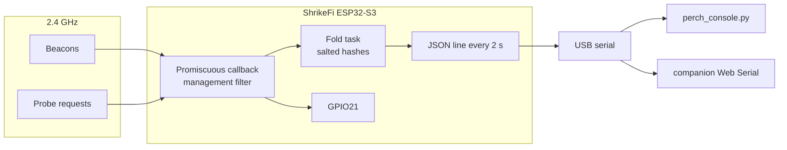

# PERCH

**A receive-only 2.4 GHz habitat auditor for the [Vicharak ShrikeFi](https://vicharak-in.github.io/shrike/) (ESP32-S3 + Renesas ForgeFPGA).**

Plug the board in. It hops Wi-Fi channels 1–13, listens to 802.11 management frames that are already on the air, and prints a census: which networks are advertising, how busy each channel is, and how many stations are nearby. It never joins a network, never active-scans, and never transmits.

> [!IMPORTANT]
> **This is not a penetration-test tool, and it is not a packet sniffer for other people's traffic.**
> The radio is receive-only. Data frames, handshakes, and raw MAC addresses are not collected. Survey only a place you are allowed to observe. See [Limitations](#limitations).

<!-- TODO: add a photo of the board + serial census: docs/images/hero.jpg -->

---

## Contents

- [Features](#features)
- [Hardware](#hardware)
- [Quick start](#quick-start)
- [Read the census](#read-the-census)
- [How it works](#how-it-works)
- [Configuration](#configuration)
- [Limitations](#limitations)
- [Roadmap](#roadmap)
- [Repository layout](#repository-layout)
- [Credits and license](#credits-and-license)

## Features

| | v0.2 |
|---|---|
| Management frames only | Beacon, probe request, probe response. Filter set once, not widened |
| No transmit path | No `esp_wifi_connect`, no active scan, no `esp_wifi_80211_tx` |
| Channel census | Round-robin dwell on channels 1-13. `ch_counts` keeps the last full dwell on every channel |
| Salted station count | SHA-256 with a boot-time salt. The salt dies on reset. No raw address on the wire |
| Status LED (GPIO21) | Blinks when a management frame is accepted |
| FPGA strobe | GPIO14 pulse, off unless `PERCH_FPGA_STROBE` is 1. Bitstream is built in Go Configure |
| Ring log | LittleFS `/census.log`, off unless `PERCH_LOG_TO_FS` is 1 |
| Laptop viewer | [`host/perch_console.py`](host/perch_console.py) — rolling SSID table over serial |
| Browser viewer | [`companion/`](companion/) — Web Serial census (Chrome / Edge) |
| Two build paths | Arduino IDE or PlatformIO for the sketch. ESP-IDF kept under `firmware/` for the same posture |

## Hardware

**You need only:** a ShrikeFi board and a **USB-C data cable** (charge-only cables will not flash). Full list in [docs/BOM.md](docs/BOM.md).

| ShrikeFi feature | Used for |
|---|---|
| ESP32-S3FN8, 2.4 GHz 802.11 b/g/n | promiscuous receive |
| 8 MB in-package flash | app. Vicharak's overview also mentions an external 4 MB part — see [docs/HOWTO.md](docs/HOWTO.md) |
| MCU user LED — **GPIO21**, active high | activity blink |
| Dual USB-C (CH9102 USB-UART + native USB) | flash on the UART port, census on either |
| Renesas SLG47910 ForgeFPGA (1120 LUT) | optional LED stretcher in `fpga/`. Not on the packet path |
| Optional PSRAM / BMS | not populated on the base board, not required |

Board docs: [Hardware overview](https://vicharak-in.github.io/shrike/hardware_overview.html) · [Pinouts](https://vicharak-in.github.io/shrike/shrike_pinouts.html) · [Getting started](https://vicharak-in.github.io/shrike/getting_started.html)

## Quick start

Full flash, serial, and troubleshooting notes: **[docs/HOWTO.md](docs/HOWTO.md)**.

### Option A — Arduino IDE (easiest)

1. Install [Arduino IDE 2.x](https://www.arduino.cc/en/software).
2. **File → Preferences → Additional boards manager URLs**, add (same as [Vicharak's guide](https://vicharak-in.github.io/shrike/getting_started.html)):
   ```
   https://raw.githubusercontent.com/espressif/arduino-esp32/gh-pages/package_esp32_index.json
   ```
3. **Tools → Board → Boards Manager** → install **"esp32" by Espressif Systems** (3.x).
4. Open `firmware/Perch/Perch.ino`. Defaults in `config.h` are fine for a first census.
5. **Tools** menu:

   | Setting | Value |
   |---|---|
   | Board | **ESP32S3 Dev Module** |
   | Port | the ShrikeFi's COM / tty port |
   | USB CDC On Boot | **Disabled** on the CH9102 port · **Enabled** on the native USB port |
   | Flash Size | **4MB** is safe on every ShrikeFi (the sketch is small). 8MB matches the FN8 if that is what the board reports |
   | Partition Scheme | Default |
   | Upload Speed | 460800 (drop to 115200 if upload fails) |

6. Click **Upload**. If it fails with *"Failed to connect"*, hold **BOOT** while plugging in, then upload again.
7. Open **Serial Monitor at 115200**. You should see a `hello` line, then a `census` JSON line every 2 seconds. GPIO21 blinks when frames arrive.

### Option B — PlatformIO

```bash
pip install platformio
cd firmware
pio run -e shrikefi -t upload
pio device monitor
# native USB port instead:  pio run -e shrikefi_native_usb -t upload
```

### Option C — ESP-IDF

The same receive-only posture, as an IDF project, lives in [`firmware/`](firmware/README.md) (`perch_main.c`). Use it if you already have IDF 5.2+. The Arduino sketch is the path this README walks.

## Read the census

A census line looks like this:

```json
{"t":"census","uptime_s":12,"ch":6,"dwell_ms":300,"mgmt_rate":18.4,"beacons":11,"probes":4,"other_mgmt":1,"stations":7,"ch_counts":[2,0,1,0,0,14,3,0,0,0,1,0,0],"ssids":[{"ssid":"lab-ap","ch":6,"rssi":-47,"hidden":false,"ht":true,"bss":"a1b2c3d4"}]}
```

`bss` is a salted hash, not the BSSID. `stations` is a count of unexpired hashes. `ch_counts` is the last completed dwell on channels 1–13, so a quiet channel stays visible after the hopper has moved on. `mgmt_rate` is management frames per second, not airtime.

| Viewer | Where |
|---|---|
| Serial Monitor | already open from the quick start |
| Laptop | `python host/perch_console.py --port COM5` (needs `pyserial`) |
| Browser | [companion](https://geneticscrol.github.io/perch/companion/) — Chrome or Edge, Web Serial, **GitHub Pages** once Actions has deployed. Local: `cd companion && python -m http.server` |

The host protocol is one-way. Nothing you type retunes the radio.

## How it works



1. Station mode is started and never connected. That is how the IDF and Arduino cores own the PHY without joining a BSS.
2. The promiscuous filter is the management mask. Data and control frames are not delivered.
3. The callback keeps beacon (subtype 8), probe request (4), and probe response (5). Other management subtypes increment a counter.
4. A hopper moves channels 1–13 every 300 ms. The DS Parameter Set on a beacon overrides the hopper's dial for that record, because adjacent channels overlap.
5. Addresses are hashed with a salt drawn at boot. Restarting the board starts a new namespace.

Design notes, if you want the longer version: [docs/02-architecture.md](docs/02-architecture.md) · [docs/03-frame-model.md](docs/03-frame-model.md) · [docs/04-operating-constraints.md](docs/04-operating-constraints.md).

## Configuration

Arduino settings live in [`firmware/Perch/config.h`](firmware/Perch/config.h):

| Setting | Default | Meaning |
|---|---|---|
| `PERCH_DWELL_MS` | 300 | time on each channel |
| `PERCH_REPORT_MS` | 2000 | census period |
| `PERCH_CHANNELS` | 13 | 1 through 13, India plan |
| `PERCH_LOCK_CHANNEL` | 0 | set to 1–13 to stop hopping |
| `PERCH_LED_PIN` | 21 | ShrikeFi MCU LED |
| `PERCH_FPGA_STROBE` | 0 | set to 1 after the stretcher bitstream is loaded |
| `PERCH_FPGA_STROBE_PIN` | 14 | header GPIO wired to the FPGA activity input |
| `PERCH_LOG_TO_FS` | 0 | set to 1 to append census lines to LittleFS |
| `PERCH_LOG_PROBES` | 0 | directed probe SSIDs stay off the log |

## Limitations

- **2.4 GHz only.** The ESP32-S3 radio has no 5 GHz or 6 GHz path.
- **Not a survey instrument.** RSSI is comparative on one board. The module antenna moves ± several dB if the board sits on metal ([antenna note](https://discuss.vicharak.in/t/issue-with-the-antenna-of-shrike-fi/417)). Occupancy is management-frame rate, not airtime.
- **Not a map of people.** Hashes expire after 60 seconds and die with the salt. Directed probe names (networks a phone is searching for) are counted, not stored.
- **Legal scope is yours.** Broadcast beacons are meant to be heard. That does not authorize recording a building you do not control. In India the Information Technology Act, 2000 penalizes unauthorized access and unauthorized interception. This note is not legal advice.
- **FPGA is a lamp, not a PHY.** 1120 LUTs cannot parse 802.11. `fpga/activity_stretcher.v` only stretches a blink.
- **Flash-size docs disagree.** Zephyr and the product table say 8 MB in-package (ESP32-S3FN8). The hardware overview also describes an external W25Q32. A 4 MB flash setting boots on both; confirm the module before selecting 8 MB.

## Roadmap

- [x] Receive-only management census, salted station count, JSON stream.
- [x] Arduino sketch and PlatformIO environments.
- [x] Serial companion (Web Serial) and `host/perch_console.py`.
- [x] Per-channel dwell counts (`ch_counts`) that survive the hop, drawn in the companion and the host console.
- [x] Optional LittleFS ring log, off by default (`PERCH_LOG_TO_FS`).
- [ ] FPGA user LED. Strobe pin and Verilog are in the tree. The SLG47910 bitstream still has to be built in Go Configure and loaded with ShrikeFlash.
- [ ] Photo of a live census in `docs/images/`.

## Repository layout

```
perch/
├── firmware/
│   ├── platformio.ini          # PlatformIO envs (CH9102 port, native USB)
│   ├── Perch/
│   │   ├── Perch.ino           # sketch (open this in Arduino IDE)
│   │   └── config.h            # ← dwell, channels, LED
│   ├── main/perch_main.c       # ESP-IDF build of the same posture
│   └── CMakeLists.txt
├── companion/                  # Web Serial census (Chrome / Edge)
├── host/
│   └── perch_console.py        # laptop viewer
├── fpga/
│   └── activity_stretcher.v    # optional, not required to run
├── docs/
│   ├── HOWTO.md
│   ├── BOM.md
│   └── 01-concept.md … 06-host-protocol.md
└── LICENSE                     # MIT
```

## Credits and license

- Hardware: [Vicharak](https://vicharak.in) ShrikeFi — docs at <https://vicharak-in.github.io/shrike/>, community on [Discord](https://discord.com/invite/EhQy97CQ9G).
- Arduino core: [espressif/arduino-esp32](https://github.com/espressif/arduino-esp32).
- Author: **Saksham Sud** ([@Geneticscrol](https://github.com/Geneticscrol)).

Released under the [MIT License](LICENSE).
